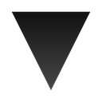

  
  <h1 align="center">VRS</h1>

## Quickstart
开发环境：`yarn dev` / `npm run dev`
产品环境：`yarn start` / `npm start`

BE + production on port 3000
FE + development on port 8080

## 搭建环境
Node.js >= 6

## 设计

### BE

### Frontend
需求：react，isomorphic，hot-reload，漂亮的错误信息，bundle splitting, react-router

Tech keywords: boilerplate (-> zeit/next)

### Frontend routers
Next.js (not RESTful)

### UI
自定义风格，black，futurism，spring animation。

Tech keywords：Tachyons, Less

### API
主要基于 GraphQL。

Tech keywords: GraphQL, Apollo/Relay

### Collaboration
Websocket。

Tech keywords: socket.io

## Acknowledgement
### 3D models
### Image resources
### Libraries

## License, etc.
MIT licensed. By Shu Ding <ds303077135@gmail.com>.
